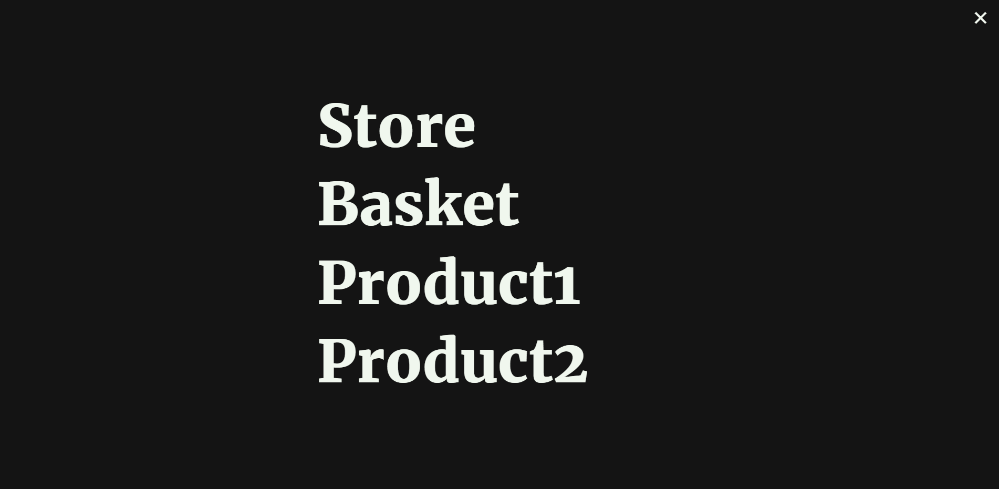

[](https://www.npmjs.com/package/react-animated-navigation)
[](https://standardjs.com)


# Beauty animated navigation menu for ```react```

### This beauty navigation menu can help you made improve your static site with another layout and animate navigation links. It's not destroy your app because it's just make new layout and almost all functionality write on scss without ts


## Examples:
---




### Check demo here:
### https://komolio.netlify.app/

---

## Install:
```bash
npm i react-animated-navigation
---
yarn add react-animated-navigation
```

## Usage:
```jsx
// don't forget change props
import { KomaNavigation } from 'react-animated-navigation';


const App = () => {
  return (
    <div>
      <KomaNavigation

        link1='/'
        title1='Main'

        link2='/history'
        title2='History'

        link3='/projects'
        title3='Projects'

        link4='/form'
        title4='Form'

      />
    </div>
  );
};
```

---
## Props:

### They are limited for responsive solution (all be good in mobile too)

| props  | required | default  | description |
| ------------- | ------------- | ------------- | ------------- |
| link1(string)| yes | - | link to something |
| title1(string) | yes | - | name of the link |
| link2(string)| yes | - | link to something |
| title2(string) | yes | - | name of the link |
| link3(string)| yes | - | link to something |
| title3(string) | yes | - | name of the link |
| link4(string)| yes | - | link to something |
| title4(string) | yes | - | name of the link |
